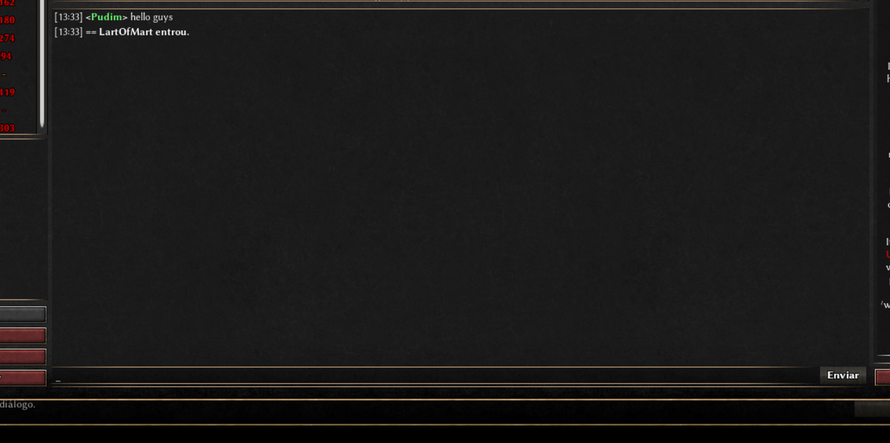
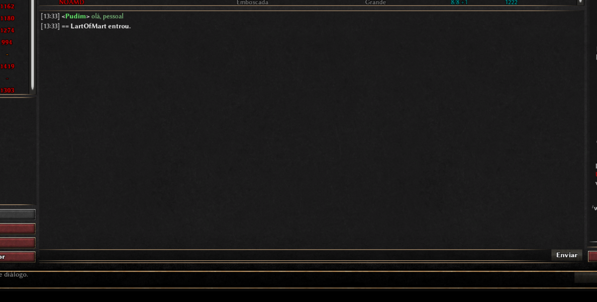
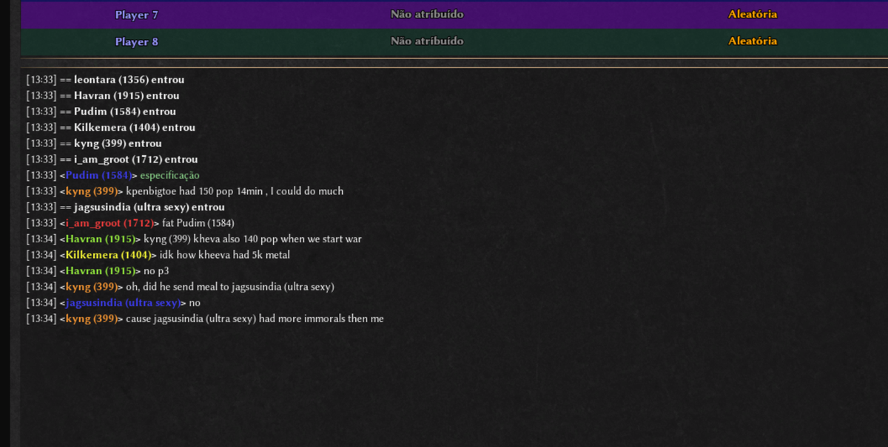
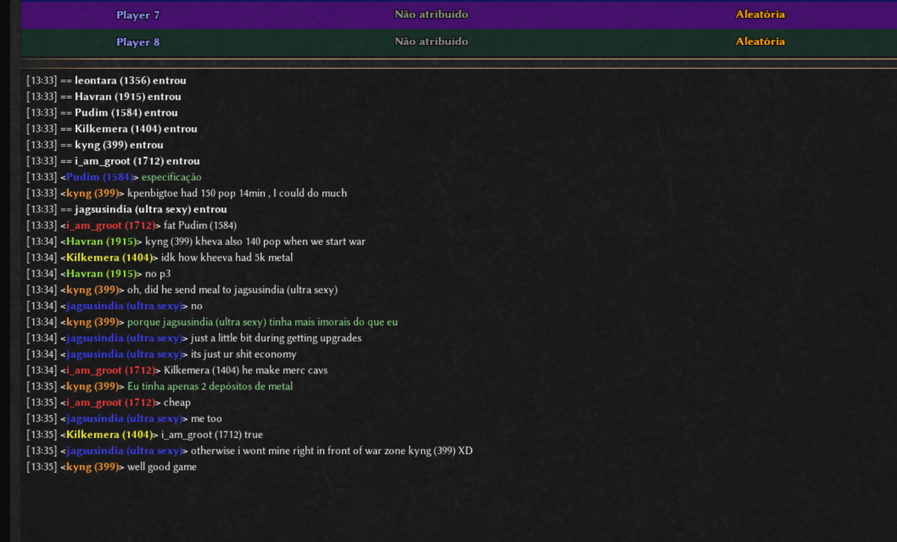

# PudimTranslate — chat translation for 0 A.D.

**Click a chat message to translate it. Click again to get the original back.** Works in a match, in
the multiplayer lobby and in the match setup screen.

**Any language, in both directions, with nothing to configure.** You never pick a language pair:

- **What was written** is detected automatically. English, Spanish, German, Russian, Chinese,
  Portuguese — it does not matter, and it does not have to be the same language twice in a row. A
  room where three people type in three different languages just works.
- **What you get back** is whatever language your 0 A.D. is installed in. Playing in Spanish gives
  you Spanish; playing in Polish gives you Polish. The mod reads the game's own locale, so there is
  no setting to find and nothing to keep in sync.

Built for players who want to play multiplayer without being locked out of the conversation.

> **Nothing to install.** No Python, no runtime, no package — the companion program is a PowerShell
> script, and Windows PowerShell ships with Windows. No dependency on PudimMod either: the two are
> independent, and running both together causes no conflict, because PudimTranslate keeps its
> helpers in its own namespace (`pudimtr_*`).

---

## ⚠️ Read this first: the translator must be running *before* the game

Translation needs a small companion program. **Start it before you open 0 A.D., every time.**

That is not a style preference — it is how the game works. 0 A.D. indexes its data folders once, at
startup, and never notices files that appear afterwards. If the translator is not already running
when the game starts, the game cannot see the bridge at all and nothing will translate for that
whole session. Closing and reopening 0 A.D. fixes it.

**So do not launch 0 A.D. the usual way. Launch it with `tools/Play0AD.bat`**, which starts the
translator, waits for the bridge to be ready, opens the game, and shuts the translator down when you
quit. One click, right order, nothing to remember.

**The first time you run it, `Play0AD.bat` creates a `0 A.D. Translator` shortcut on your desktop**,
carrying the 0 A.D. icon so it sits recognisably next to the game's own shortcut. Use it from then
on, in place of your normal 0 A.D. shortcut, and you are done — one click starts everything in the
right order.

The `.bat` file itself will always show the plain Windows script icon. That is not something a mod
can change: Windows takes a `.bat` icon from the file *type*, not from the file, so only a shortcut
can carry a custom one. That is precisely why the shortcut is created for you.

Both the shortcut and the launcher work out where 0 A.D. is installed on their own — they look in the
usual install locations, in the Steam libraries, and finally read the target of the Start Menu
shortcut the installer left behind. The path found is remembered in `tools/caminho_do_jogo.txt`, next
to the scripts, so the search happens only once. That file is machine-specific and is deliberately
kept out of the repository, so nobody inherits somebody else's install path. If the game is somewhere
unusual and the search fails, run it once with the path and it is remembered from then on:

```
powershell -File tools\Play0AD.ps1 -Jogo "C:\your\path\to\pyrogenesis.exe"
```

If you prefer to keep the two apart, run `tools/PudimTradutor.bat`, leave its window open, and only
then open 0 A.D. yourself.

---

## Installation

Download the repository (**Code → Download ZIP**, or `git clone`) and put the `PudimTranslate`
folder inside your 0 A.D. `mods` directory:

| System  | Path |
|---------|------|
| Windows | `%APPDATA%\0ad\mods\` — or `Documents\My Games\0ad\mods\` |
| Linux   | `~/.local/share/0ad/mods/` |
| macOS   | `~/Library/Application Support/0ad/mods/` |

If you are unsure, the game's own reference is at
<https://trac.wildfiregames.com/wiki/GameDataPaths>.

The folder must sit directly inside `mods/`, so that `mods/PudimTranslate/mod.json` exists — a
common mistake is ending up with `mods/PudimTranslate/PudimTranslate/`.

Then open 0 A.D., go to **Settings → Mod Selection**, pick **PudimTranslate**, click **Enable**,
then **Save Configuration** and **Start Mods**.

**Nothing to install.** The companion program is a PowerShell script, and Windows PowerShell ships
with Windows 10 and 11 — no runtime, no interpreter, no package to add. The `.bat` files call it with
`-ExecutionPolicy Bypass`, which applies to that one call and changes no system setting.

To update, replace the folder with the newer version and restart the game.

---

## How to translate a message

**Click the message. That is the whole thing.** There is no button to find and no menu to open — the
line of text *is* the button.

The screenshots below happen to show English being turned into Portuguese, because that is the
author's setup — but nothing in them is specific to that pair.

In the multiplayer lobby, someone says hello in a language you do not read:



Click that line and it comes back in your language, in green so you can tell at a glance what was
translated and what is still as it was written:



**Click it again to get the original back.** Nothing is lost.

It works the same in the match setup screen, where most of the talking happens before a game. Here a
whole conversation is in a foreign language:



Click any lines you want. Each one is independent, so you can translate only what you care about:



In a match it is the same gesture: click the chat line on screen. There the line also carries a
tooltip, so hovering a translated message shows the original wording without switching it back.

A few things worth knowing:

- While a phrase is being fetched the line shows *translating…*. It usually lasts a blink.
- If it says the translator is off, you opened the game without the translator running. Close 0 A.D.,
  start it with the desktop shortcut, and try again.
- System notices (*"== Someone joined."*) do nothing when clicked, on purpose: 0 A.D. already shows
  those in your own language, so there is nothing to translate.
- A phrase already translated once is free forever — it is cached on disk, so repeats like *gg* or
  *well played* never hit the network again.

**Do not want to click at all?** Set `pudimtranslate.auto` to `true` in the user config and every
incoming message is translated as it arrives. This applies **inside a match only** — in the lobby and
the match setup screen you still click the messages you want.

**Neither language is ever configured.** The one you read is taken from your 0 A.D. install, and the
one that was written is detected from the message itself — see the top of this page.

---

## Why a companion program at all

There is no way around it: the 0 A.D. GUI script engine has **no HTTP** — no `fetch`, no XHR. The
only networking exposed to scripts is the XMPP lobby and mod.io, both in C++. A mod simply cannot
call a translation service.

What a mod *can* do is read and write files. So the mod writes the phrase to a file, the companion
program translates it, and writes the answer back:

```
mod  --writes-->  saves/campaigns/pudim_tr_req.json  --reads-->  PudimTradutor.ps1  --HTTP--> Google
mod  <---reads--  saves/campaigns/pudim_tr_res.json  <--writes-------'
```

No API key and no sign-up: it calls the same free endpoint the translate.google.com page uses.
Translations are cached on disk, so a phrase already seen costs no network round trip.

That folder is not a matter of taste. The GUI's `ReadJSONFile`/`WriteJSONFile` only accepts a closed
list of paths — `gui/`, `simulation/`, `maps/`, `campaigns/`, `saves/campaigns/`,
`config/matchsettings.json` and `config/matchsettings.mp.json`. Anything else answers *Restricted
access to …*. Of those, `saves/campaigns/` is the only writable user folder. It does not disturb
campaigns: the game only lists `*.0adcampaign` there, and these files are `.json`.

The response file is always exactly 64 KB, padded with spaces. The game's VFS remembers a file's
size from when it indexed the folder, so a file that grows gets read truncated — a JSON cut in half.
A fixed size keeps that remembered value correct forever.

## How it works, per screen

**In a match** no button had to be invented. The game's own `ChatOverlay` already treats each chat
line as a button — `gui/session/chat/ChatOverlay.js` sets `ghost = !chatMessage.callback` — and
sizes the line to the exact width of its text. So attaching a callback makes the message clickable
without covering the map or stealing clicks meant for units.

**In the lobby and the match setup screen** the chat is a `type="list"`, one item per message. There
is no per-line button there, but there is selection, so the gesture ends up the same: click the
message to translate it.

## Privacy

The chat messages you choose to translate are sent to Google Translate. Nothing else leaves your
machine, and nothing is sent until you click a message — unless you turn on `pudimtranslate.auto`,
in which case every chat message that arrives during a match is sent as it arrives.

System notices are never sent at all, and a phrase already in the on-disk cache is answered locally,
without touching the network.

## Language

The mod's own text (tooltips, notices) is Portuguese or English, following the game's language.

## License

PudimTranslate is released under the **GNU General Public License v3 or later** — see `LICENSE`.

All code is original — see `NOTICE`.
